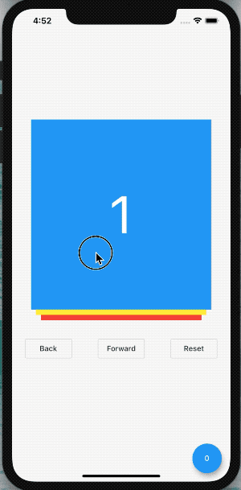

# TCard

[](https://github.com/xrr2016/tcard/stargazers) [](https://pub.dev/packages/tcard) 

## Install

```yml
dependencies:
  tcard: ^0.1.1
```

## Uasge

### Normal widget

```dart
TCard(
  cards: [
    Container(color: Colors.blue),
    Container(color: Colors.yellow),
    Container(color: Colors.red),
  ],
)
```



### Network image

```dart
List<String> images = [
  'https://gank.io/images/5ba77f3415b44f6c843af5e149443f94',
  'https://gank.io/images/02eb8ca3297f4931ab64b7ebd7b5b89c',
  'https://gank.io/images/31f92f7845f34f05bc10779a468c3c13',
  'https://gank.io/images/b0f73f9527694f44b523ff059d8a8841',
  'https://gank.io/images/1af9d69bc60242d7aa2e53125a4586ad',
];

List<Widget> cards = List.generate(
  images.length,
  (int index) {
    return Container(
      decoration: BoxDecoration(v
        color: Colors.white,
        borderRadius: BorderRadius.circular(16.0),
        boxShadow: [
          BoxShadow(
            offset: Offset(0, 17),
            blurRadius: 23.0,
            spreadRadius: -13.0,
            color: Colors.black54,
          )
        ],
      ),
      child: ClipRRect(
        borderRadius: BorderRadius.circular(16.0),
        child: Image.network(
          images[index],
          fit: BoxFit.cover,
        ),
      ),
    );
  },
);

TCard(
  size: Size(400, 600),
  cards: cards,
);
```


Image from [gank.io](gank.io)

## Property

| property | type | default | description | required |
| :- | :---: | :---: | :---: | :-: |
| cards | `List<Widget>` | `null` | Render cards | `true` |
| size | `Size` | `null` | Card size | `false` |
| controller | `TCardController` | `null` | Card controller | `false` |
| onForward | `ForwardCallback` | `null` | Forward animation callback | `false` |
| onBack | `BackCallback` | `null` | Back animation callback | `false` |
| onEnd | `EndCallback` | `null` | Forward end callback | `false` |

## Contribute

1. Fork it (https://github.com/xrr2016/tcard.git)
2. Create your feature branch (git checkout -b feature/foo)
3. Commit your changes (git commit -am 'Add some foo')
4. Push to the branch (git push origin feature/foo)
5. Create a new Pull Request

## License

[MIT](./LICENSE)
